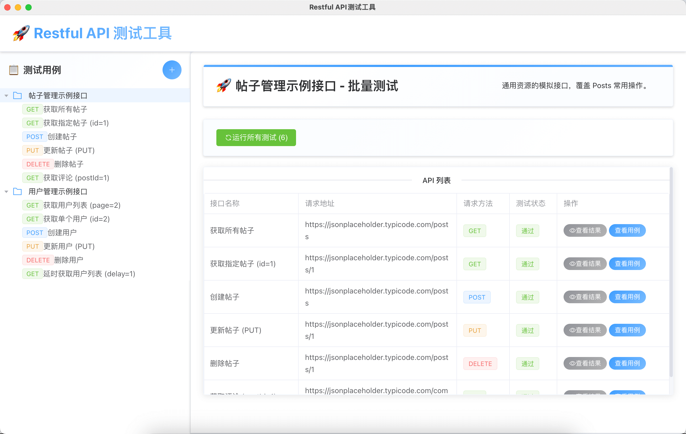
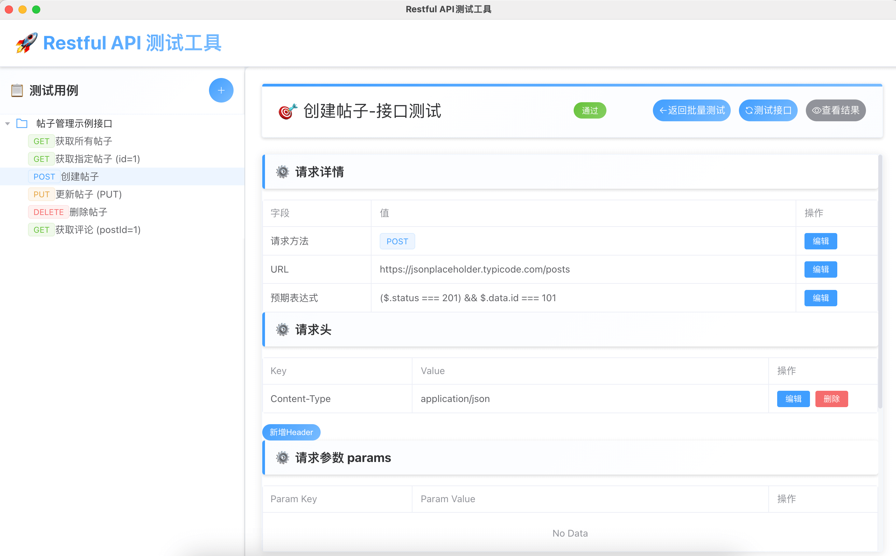

## 前言

Restful-api-test是一款基于 Electron + Vue3 的跨平台 RESTful 接口测试工具。那么肯定有人会问，市面上已经有很多类似的 RESTful 接口测试工具，比如 Postman、Apifox 等。那么 restful-api-test 有什么优势呢？

相比较其他工具，Restful-api-test首先去除了一些繁琐的功能，重点关注以下几个方面：

- 支持一次性执行多个接口并汇总结果，便于迭代中的快速回归。
- 支持将接口测试流程沉淀为结构化“测试用例”，可重复运行、便于版本化管理。
- 支持设置期望断言表达式，满足复杂的校验需求。
- 支持桌面端本地跨平台运行，无需云端依赖，适合边缘或隔离环境。

## 整体功能介绍

首先看一下 Restful-api-test 的整体布局由三部分组成，包括顶部标题栏、左侧的测试用例列表、右侧的单接口测试视图与批量测试视图。


## 测试用例管理

### 测试用例导入

通过点击左侧测试用例上方的“导入测试用例”按钮，即可添加新的测试用例。


其中导入的测试用例必须是 json 格式的，并且包含如下字段：

- name[必填字段]：测试用例的名称，用于在列表中显示。
- description[必填字段]：测试用例的描述，用于详细说明测试用例的作用。
- apis[必填字段]：一个数组，包含多个接口测试用例。每个接口测试用例包含以下字段：
  - name[必填字段]：接口测试用例的名称，用于在列表中显示。
  - url[必填字段]：接口的 URL 地址。
  - method[必填字段]：HTTP 请求方法，如 GET、POST、PUT、DELETE 等。
  - headers[选填字段]：HTTP 请求头，用于设置请求头的信息。
  - params[选填字段]：URL 参数，用于在 GET 请求中传递参数。
  - body[选填字段]：请求体，用于在 POST、PUT、PATCH 请求中传递数据（其中 body 默认的是 json 格式）。
  - expectedExpression[选填字段]：期望的断言表达式，用于判断接口返回的数据是否符合预期，从而判断接口测试是否通过。

一个完整的测试用例示例如下：

```json
{
  "name": "帖子管理示例接口",
  "description": "通用资源的模拟接口，覆盖 Posts 常用操作。",
  "apis": [
    {
      "name": "获取所有帖子",
      "url": "https://jsonplaceholder.typicode.com/posts",
      "method": "GET",
      "headers": {
        "Accept": "application/json"
      },
      "expectedExpression": "($.status === 200) && Array.isArray($.data) && $.data.length > 0"
    },
    {
      "name": "获取指定帖子 (id=1)",
      "url": "https://jsonplaceholder.typicode.com/posts/1",
      "method": "GET",
      "headers": {
        "Accept": "application/json"
      },
      "expectedExpression": "($.status === 200) && $.data.id === 1"
    }
  ]
}
```
### 测试用例的删除

对于已经导入的测试用例，用户可以在左侧测试用例列表中点击删除按钮，删除该测试用例。


### 测试用例编辑

对于已经导入的测试用例，用户可以在左侧测试用例列表中点击“编辑测试用例”按钮，进入编辑模式，对测试用例的"名称"和"描述"字段进行修改。


### 批量执行测试用例

用户可以在测试用例列表中点击“批量测试”按钮，也可以选中测试用例后，在右侧批量测试视图中点击“运行所有测试用例”按钮，执行选中的测试用例。


### 导出测试用例

对于已经导入的测试用例，用户在进行二次编辑后，可以点击测试用例列表上的“导出测试用例”按钮，将选中的测试用例导出为 json 格式的文件，便于测试用例的版本管理与分享。


## 单个接口测试用例的管理

在 Restful-api-test 中，一个测试用例一般包含若干个接口测试用例，在左侧测试用例列表中选中具体的接口测试用例，可以对单个接口测试用例进行管理。



单接口测试用例由顶部的操作栏、请求详情、请求头、请求参数（params）、请求体（body）四个部分组成。
其中顶部的操作栏可以对单个接口测试用例进行单独测试、显示测试结果、查看接口返回结果、返回批量测试界面。

请求详情模块可以配置接口的请求方法、URL和预期表达式。这里重点介绍一下预期表达式的配置，因为表达式如何编写决定了测试用例是否通过。

表达式是标准 JavaScript 布尔表达式，运行时通过 `new Function('$', "use strict"; return !!(expr))` 执行。其中上下文对象通过形参名 $ 传入，支持以下字段：
- $.status ：HTTP 状态码（如 200 ）。
- $.data ：响应体（通常是 JSON）。
- $.headers ：响应头对象。
- $.request ：请求信息对象（含 url / method / headers / body ）。
- $.response ：和顶层一致的响应对象封装 { status, data, headers } 。

比如如下表达式：

1. 判断 HTTP 状态码是否为 200，并且响应体是一个数组，数组长度大于 0。
```typescript
($.status === 200) && Array.isArray($.data) && $.data.length > 0
```
2. 判断 HTTP 状态码是否为 200，并且响应体是一个对象，对象的 id 字段等于 1。
```typescript
($.status === 200) && $.data.id === 1
```
3. 判断 HTTP 状态码是否为 200。
```typescript
($.status === 200)
```

预期表达式支持任意 JS 内置判断与方法，例如以下写法都是合法的：

- `Array.isArray($.data)`
- `typeof $.data === 'object' && $.data.ok === true`
- `String($.headers['content-type']).includes('json')`

除了最重要的预期表达式配置之外，还可以对请求的 URL、请求头、请求参数（params）、请求体（body）进行配置。

## License

本项目遵循 `MIT` 开源协议。详见仓库根目录中的 `LICENSE` 文件。
